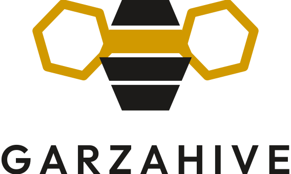

<div align="center">
  
</div>

# GarzaHive Brand

Logo system for GarzaHive. The full specification — construction, clear space,
minimum sizes, colour, typography, placement and misuse — is in
**[GarzaHive-Logo-Key.pdf](GarzaHive-Logo-Key.pdf)**.

This directory is self-contained and does not touch the upstream Hivekeep logo
pipeline (`logo.svg`, `scripts/gen-logo-assets.mjs`, `scripts/logo-paths.json`),
which is left exactly as it is.

---

## The mark

A bee reduced to pure hive geometry. The abdomen is a single hexagon sliced into
four bands; the wings are two flat-top hexagons drawn in outline. Nothing is
illustrated — every edge comes off the same hexagonal grid the honeycomb is
built on.

Four bands read as four agents in one body: a household of specialists rather
than a single assistant. The wings are open outlines rather than solids, for a
platform that is self-hosted and open with nothing sealed off. Amber marks the
one active cell.

## Files

```
brand/
├── GarzaHive-Logo-Key.pdf   full specification, 10 pages
├── logo/
│   ├── svg/                 13 vector lockups — use these
│   ├── png/                 2000px raster exports
│   └── favicon/             16 / 32 / 48 / 180 / 512 px
├── fonts/                   Outfit (SIL OFL)
└── src/                     parametric generators
```

### Which file to use

| Context | File |
| --- | --- |
| Default, stacked or square placements | `logo-primary-vertical.svg` |
| Headers, nav bars, README banners | `logo-primary-horizontal.svg` |
| On charcoal or photography | `logo-reversed-horizontal.svg` |
| One-colour print, engraving | `logo-mono-charcoal.svg` |
| Dark or busy backgrounds | `logo-mono-white.svg` |
| App icon, avatar slot, PWA | `icon-primary.svg` |
| 24 px and below, favicons | `icon-mono-charcoal.svg` |
| Where the icon already appears nearby | `wordmark-charcoal.svg` |

Every SVG has a transparent background and no clipping mask. The wordmark ships
as outlined paths, so rendering the logo requires no font install.

## Colour

| Role | Name | Hex | RGB |
| --- | --- | --- | --- |
| Accent | Hive Amber | `#D19900` | 209 · 153 · 0 |
| Primary | Hive Charcoal | `#1C1B19` | 28 · 27 · 25 |
| Background | Comb White | `#F7F6F2` | 247 · 246 · 242 |
| Dark surface | Ink | `#171614` | 23 · 22 · 20 |
| Secondary | Deep Teal | `#0C4E54` | 12 · 78 · 84 |
| Border | Border | `#D4D1CA` | 212 · 209 · 202 |

Amber is the only accent. Charcoal on Comb White clears 15.1:1 and white on Ink
clears 13.4:1. Amber on Comb White is only 2.6:1 — never use it for body text.

Pantone equivalents in the logo key are hex conversions, not measured against
physical swatches. Confirm with a printer before any spot-colour run.

## Rules worth memorising

- **Clear space** is `X` on all four sides, where `X` is one band pitch — a
  quarter of the icon height.
- **Minimum size** is 132 px for the horizontal lockup, 104 px for the vertical
  lockup, 24 px for the icon. Below 24 px the bands close up; switch to the
  single-colour icon.
- **On amber backgrounds** the mark must be single-colour charcoal.
- **Never use the logo as an agent avatar.** Agents get their own generated
  avatars — a shared logo there would flatten the distinction between them.
- Do not recolour the bands, stretch, rotate, add effects, reorder the bands,
  fill the wings, respace the wordmark, or box the mark. If a placement seems to
  need one of those, change the layout, not the logo.

## Naming

`GarzaHive` in prose — camel case, one word, no space. `GARZAHIVE` in the
lockup, set in Outfit SemiBold at +170 tracking.

## Regenerating

All artwork is generated parametrically. The geometry constants live at the top
of `src/build_logo.py` — wing radius, rotation, band gap and hexagon proportions
are each a single variable.

```bash
pip install cairosvg reportlab fonttools
python brand/src/build_logo.py   # → brand/logo/svg/
python brand/src/build_key.py    # → brand/GarzaHive-Logo-Key.pdf
```

For raster output, render the SVG at the target pixel width rather than
upscaling a PNG.

## Licence

The logo artwork is © Garza. Outfit is licensed under the SIL Open Font Licence
1.1 — see [`fonts/OFL.txt`](fonts/OFL.txt).
